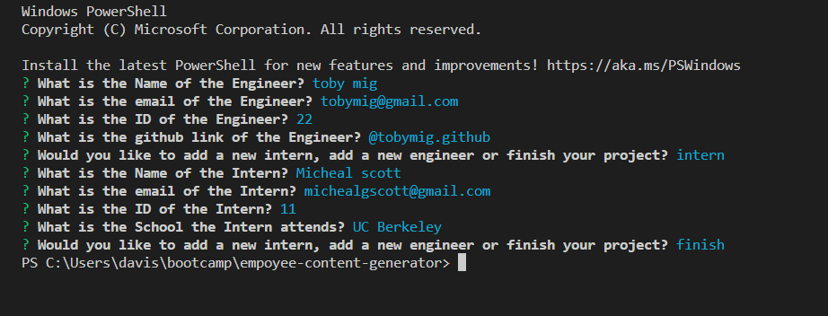

# empoyee-content-generator


## Deployed link
none: but here is a link to a walkthrough video https://drive.google.com/file/d/1_MhvHBKD_qKMkz1Rc4e74n0yaT76AJcy/view

## site picture



## Technologies Used
- HTML : Used to format the content of the page
- CSS : Used to style the HTML on the web browser
- JavaScript : Used to give the page logical functions and a dynamic interface
- node.js : used to work with user interface
- Git : Used to version control the code during the creation process
- GitHub : hosting the repositroy responsible for the website

## Authors
- writen styled and built by Mason Davis

## summary
This repository contains all the code to generate a companies employee data. it works with a user to take in content and display it on a new web page in a way that is thoughtfull and concise. 

## Code Snippet
This is a snippet Showing the formula used to generate the HTML cards inside of the JavaScript. this is a key component to generating a whole webpage in Javascript.

```javaScript
contentFinal.push(`
<div class="card m-2" style="width: 18rem; box-shadow: 5px 5px 5px rgb(112, 112, 112)">
  <div class="card-body">
    <h2 class='card-title bg-secondary text-white text-center d-flex'>${nameTemp} <i class="fas ${icon}"></i></h2>
    <h3 class="card-subtitle mb-2 text-muted d-flex">Role: ${roleTemp}</h3>
    <h3 class="card-subtitle mb-2 text-muted d-flex">ID: ${idTemp}</h3>
    <h3 class="card-subtitle mb-2 text-muted d-flex">${othertemp}</h3>
    <a href="mailto: ${emailTemp}" class="card-link">Email</a>
    </div>
</div>
`)     
```


## Author links
[LinkedIn](https://www.linkedin.com/in/davis-mason-t/)
[GitHub](https://github.com/Md7113)